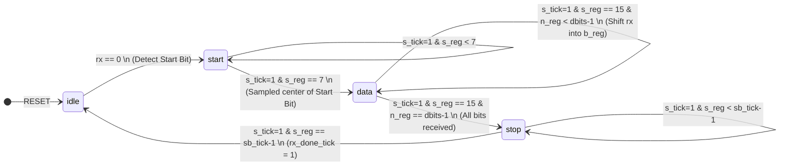
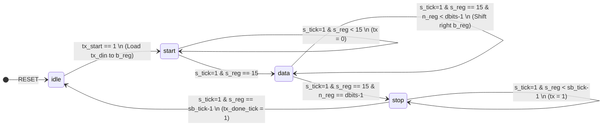

# Full-Duplex UART Controller with FIFO Integration

## 📌 Project Overview
This repository contains a complete, robust implementation of a **Universal Asynchronous Receiver-Transmitter (UART)** system designed in Verilog. The project is structured to support full-duplex serial communication and integrates Xilinx Vivado FIFO IP blocks for efficient data buffering. 

The design features highly parameterized Transmitter and Receiver modules, each controlled by precise Finite State Machines (FSMs), and relies on a customizable baud rate generator. A comprehensive testbench is included to verify simultaneous, bidirectional data exchange between two instantiated UART nodes.

## ✨ Key Features
* **Full-Duplex Communication:** Independent `uart_tx` and `uart_rx` modules allow simultaneous transmission and reception of data.
* **FIFO Buffering:** Seamless integration with Vivado `fifo_generator` IP to buffer incoming and outgoing data, preventing data loss and optimizing processor interface timing.
* **Custom Baud Rate Generator:** A parameterized `timer` module utilizes a `TIMER_FINAL_VALUE` to accurately synthesize the required oversampling ticks (`s_tick`) from the system clock.
* **Oversampling Architecture:** The Receiver FSM employs a 16x oversampling scheme (`sb_tick = 16`) to accurately sample the middle of each received data bit, significantly improving noise immunity.
* **Configurable Data Width:** The data bit width (`dbits`) is parameterized (default: 8 bits), allowing for flexible frame sizes.

---

## 🏗️ System Architecture & Signal Description

### `uart` (Top Module)
Integrates the Receiver, Transmitter, Baud Rate Generator, and the dual FIFO buffers.

| Signal | Direction | Description |
| :--- | :---: | :--- |
| `clk`, `reset` | Input | System clock and active-low asynchronous reset. |
| `TIMER_FINAL_VALUE` | Input | Divisor value to configure the baud rate. |
| `rx`, `tx` | In / Out | Serial data input (Receive) and serial data output (Transmit). |
| `w_data`, `wr_uart`| Input | Parallel data to be transmitted and its write-enable signal (pushes to TX FIFO). |
| `tx_full` | Output | Flag indicating the Transmit FIFO is full. |
| `r_data`, `rd_uart`| Out / In | Parallel data received and its read-enable signal (pops from RX FIFO). |
| `rx_empty` | Output | Flag indicating the Receive FIFO is empty. |

---

## ⚙️ Finite State Machines (FSM)

### UART Receiver (`uart_rx`) FSM
The Receiver constantly monitors the `rx` line for a high-to-low transition (Start bit). It uses the 16x oversampling tick (`s_tick`) to sample data at the center of each bit period (`s_reg == 7` for the start bit, and `s_reg == 15` for data bits).

### UART Transmitter (`uart_tx`) FSM
The Transmitter waits for a `tx_start` signal (triggered when the TX FIFO is not empty). It then shifts out the start bit, the data bits, and finally the stop bit, utilizing the full 16x tick cycle (`s_reg == 15`) for each bit duration.

---

## ✅ Simulation & Verification
A rigorous full-duplex testbench (`duplex_uart_tb.v`) is provided. It instantiates two identical UART modules (`uart_a` and `uart_b`) with their `tx` and `rx` lines cross-connected. 

**Verification Flow:**
1. Both modules are initialized and their Baud Rate Generators are configured with a `TIMER_FINAL_VALUE` of 650.
2. `uart_a` is loaded with data `0x3F`, and `uart_b` is simultaneously loaded with `0xAB`.
3. Transmission is triggered concurrently. The testbench accurately simulates the delays required for the Start bit, Data bits, and Stop bit based on the calculated baud rate ticks.
4. Following transmission, the testbench asserts the read-enable signals (`rd_uart_a`, `rd_uart_b`) to pop the received data from the RX FIFOs, verifying successful bidirectional data exchange without collision.
